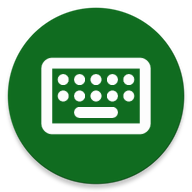

# Simple Keyboard

A lightweight keyboard app that helps chatting with your friends, or inserting any other texts, numbers or symbols. You can choose from multiple different languages and layouts.

You can create handy clips and pin frequently used ones for easy access. You can toggle vibrations, popups on keypresses or select your language from the list of supported ones.

It comes with material design and dark theme by default, provides great user experience for easy usage. The lack of internet access gives you more privacy, security and stability than other apps.

Contains no ads or unnecessary permissions. It is fully opensource, provides customizable colors.

Check out the full suite of apps here:
https://github.com/FossifyOrg

