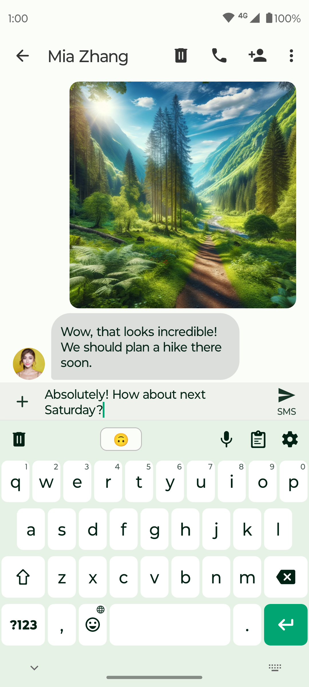
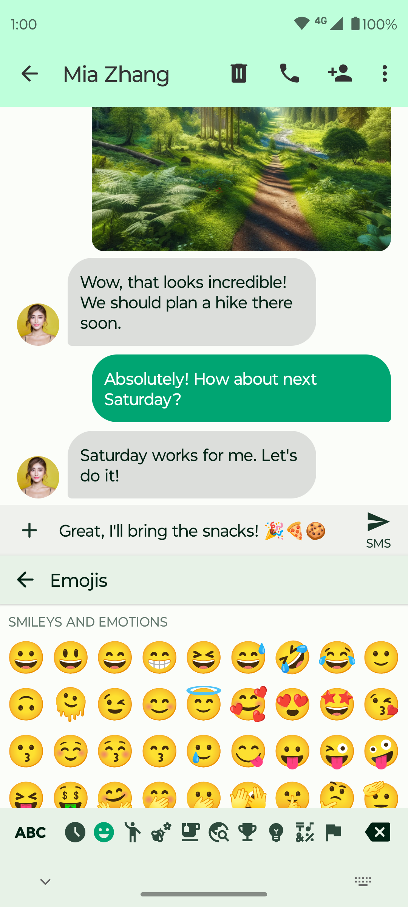
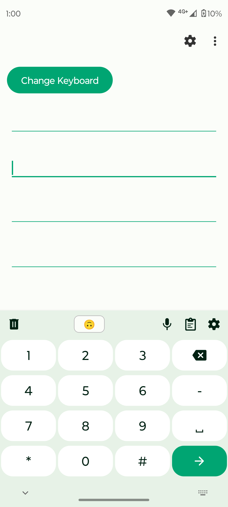

# Fossify Keyboard

Introducing Fossify Keyboard – your go-to solution for effortless and efficient typing. Experience a seamless typing experience designed to cater to all your needs, whether chatting with friends or inserting texts, numbers, or symbols.

**📶 OFFLINE FUNCTIONALITY:**    
Fossify Keyboard operates entirely offline without internet permission, allowing you to use it anytime, anywhere, without needing an internet connection. This also provides you with more privacy, security, and stability compared to other keyboards that connect to the internet.

**🌐 MULTIPLE LANGUAGES AND LAYOUTS:**    
Choose from a wide variety of languages and keyboard layouts. Fossify Keyboard supports multiple languages, making it easy for you to switch and type in your preferred language effortlessly.

**📋 HANDY CLIPBOARD:**    
Create clips and pin frequently used ones for easy access. This feature allows you to insert your most-used texts quickly, saving you time and effort.

**📳 CUSTOMIZABLE SETTINGS:**    
Tailor your typing experience by toggling vibrations, popups on key presses, and selecting your preferred language from the list of supported ones. Personalize your keyboard settings to suit your preferences.

**🌙 MATERIAL DESIGN AND DARK THEME:**    
Enjoy a sleek, modern design with a default dark theme. Fossify Keyboard offers a visually appealing and comfortable user experience, making typing a pleasure.

**🔒 PRIVACY AND SECURITY:**    
Your privacy is our top priority. Fossify Keyboard does not collect or share any user information with third parties. Experience peace of mind knowing your typing activity remains private and secure.

**🎨 CUSTOMIZABLE COLORS:**    
Personalize your keyboard with customizable colors. Fossify Keyboard allows you to choose and adjust colors to match your style and preferences.

**🌐 OPEN-SOURCE TRANSPARENCY:**    
Fossify Keyboard is fully open-source, providing you with transparency and security. You have access to the source code for audits, ensuring a trustworthy and reliable typing tool.

Experience typing like never before – efficient, personalized, and secure. Download Fossify Keyboard now and elevate your typing experience.

➡️ Explore more Fossify apps: https://www.fossify.org    
➡️ Open-Source Code: https://www.github.com/FossifyOrg    
➡️ Join the community on Reddit: https://www.reddit.com/r/Fossify    
➡️ Connect on Telegram: https://t.me/Fossify    

